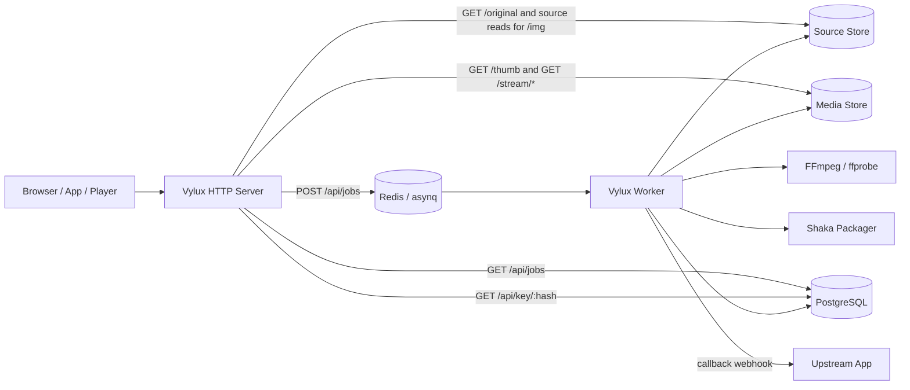

# Architecture Overview

Vylux is not a collection of shell scripts. It is a single binary backed by shared infrastructure: an HTTP server, a queue worker, PostgreSQL, Redis, S3-compatible storage, and the FFmpeg / libvips / Shaka Packager toolchain.

:::tip Read this page as a boundary map
If you are deciding where a responsibility belongs, start here. Vylux owns media processing and delivery mechanics; your upstream application still owns business authorization and end-user policy.
:::

## Runtime roles

### `all`

- runs the HTTP server and worker together
- useful for local development and minimal deployments

### `server`

- runs only the HTTP server, synchronous image delivery, playback proxying, and primary metrics
- pair it with a separate worker when scaling or failure isolation matters

### `worker`

- runs only the queue consumer
- exposes `/metrics` and `/healthz` on `WORKER_METRICS_PORT`

This keeps the implementation model unified while still allowing separate server and worker deployments.

## System structure

## Components and boundaries

| Component | Responsibility |
| --- | --- |
| HTTP server | serves `/img`, `/original`, `/thumb`, `/api/jobs`, `/stream`, `/api/key`, `/healthz`, `/readyz`, and `/metrics` |
| Worker | consumes async jobs, downloads source media, runs cover / preview / transcode workflows, and sends webhooks |
| PostgreSQL | stores job rows, workflow results, retry metadata, wrapped content keys, and image cache tracking |
| Redis | backs asynq queues, task state, and API/key endpoint rate limiting |
| Source store | source bucket plus `SOURCE_S3_*`; immutable or upstream-managed source objects; Vylux reads from it |
| Media store | media bucket plus `MEDIA_S3_*`; derived images, previews, covers, playlists, segments, and caches; Vylux reads and writes it |
| Media toolchain | `vips` for images, FFmpeg / ffprobe for video, Shaka Packager for HLS CMAF packaging |

## HTTP server responsibilities

- `/img` real-time image processing
- `/original` signed source-object proxying
- `/thumb` signed reads of already-generated image assets
- `/api/jobs` job creation and lookup
- `/stream/{hash}/*` HLS asset proxying
- `/api/key/{hash}` Bearer-token validation and 16-byte key delivery
- `/healthz`, `/readyz`, and `/metrics`

The HTTP side also owns:

- request tracing middleware and `X-Trace-ID`
- Prometheus HTTP metrics
- readiness checks
- API key auth and Redis-backed rate limiting

## Worker responsibilities

- download source media
- generate cover, preview, and transcode outputs
- generate encrypted HLS CMAF when requested
- upload derived artifacts
- persist status, progress, and results JSON
- produce machine-readable workflow results and retry plans when needed
- deliver success or failure webhooks

The worker does not only run `video:transcode`. Supported job types today are:

- `image:thumbnail`
- `video:cover`
- `video:preview`
- `video:transcode`
- `video:full`

`video:full` is a single workflow handler that downloads the source once and coordinates cover, preview, and transcode stages within one task.

## Queue model

Vylux uses asynq with three named queues:

| Queue | Weight | Purpose |
| --- | --- | --- |
| `critical` | `6` | fast tasks such as `image:thumbnail` |
| `default` | `3` | normal video jobs |
| `video:large` | `1` | lower-priority large transcode work |

For video jobs, the `POST /api/jobs` path performs a source-storage preflight check, measures the actual source size, and can route large work to `video:large` before enqueueing.

:::note Queue selection is decided by Vylux, not the caller
Callers do not choose `critical`, `default`, or `video:large` directly. The server validates the request, inspects the real source object when needed, and then routes the task.
:::

## Shared state

- PostgreSQL stores jobs, results, and wrapped keys
- Redis stores queue state and rate limits
- source and media stores hold original and derived media assets

## What Vylux does not do

Vylux is intentionally narrow in scope:

- it transforms media
- it exposes playback and management APIs
- it does not replace upstream authorization or content management systems

Your upstream application is still responsible for deciding who can submit jobs, who can receive signed URLs, and who is allowed to obtain playback tokens.

## Recommended reading order

- for request-level behavior, read [Request Lifecycle](./request-lifecycle)
- for object-key naming and storage mapping, read [Storage Layout](./storage-layout)
- for concrete media behavior, read [Image Pipeline](../media/image-pipeline) and [Video Pipeline](../media/video-pipeline)
