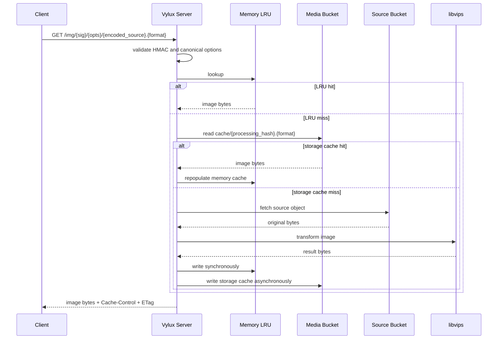
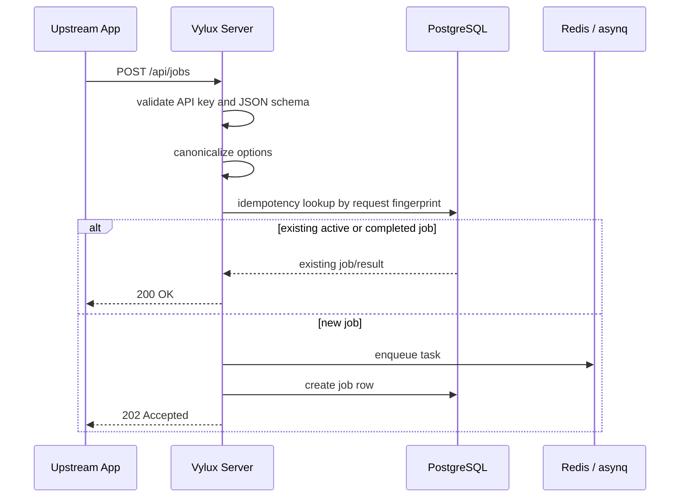
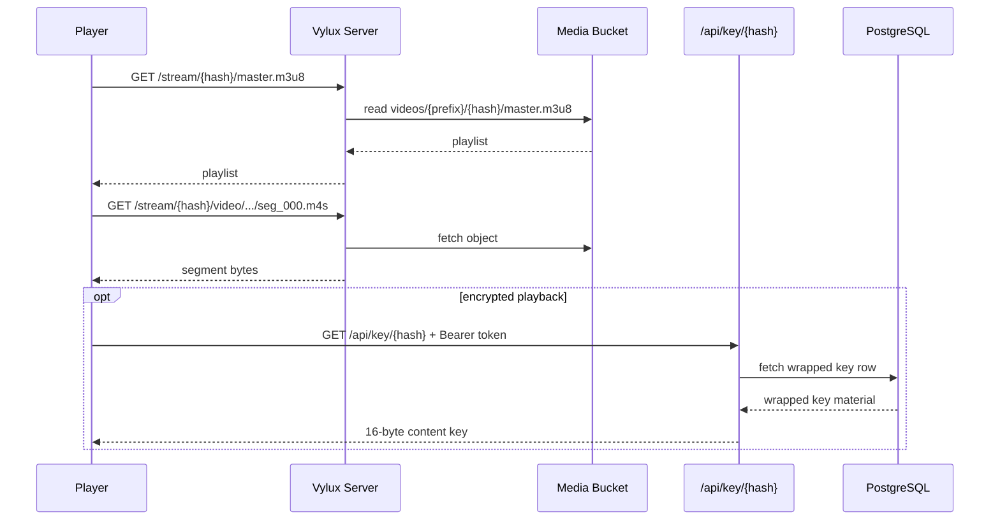

# Request Lifecycle

## 1. Real-time image flow

Key implementation details:

1. validate the HMAC signature and normalized options
2. check memory LRU, then the media-bucket storage cache
3. on a miss, fetch the original from the source bucket
4. use singleflight to suppress duplicate fetch and transform work
5. transform with libvips
6. write the result to memory immediately and to storage asynchronously
7. return CDN-friendly cache headers and an `ETag`

This path is fully synchronous and does not require the queue.

## 2. Job submission flow

The important part is not only enqueueing work. The server first computes a request fingerprint from:

1. `type`
2. `hash`
3. `source`
4. canonicalized `options`

This is what gives `POST /api/jobs` its idempotency behavior. The source bucket itself is deployment-owned runtime config, not caller input.

For video jobs, the server also checks the configured source store before enqueueing so it can confirm existence, measure actual size, and route oversized work to `video:large` when needed.

## 3. Worker execution flow

Worker execution falls into two categories: single-stage jobs and the `video:full` workflow.

### Single-stage jobs

- `image:thumbnail`
- `video:cover`
- `video:preview`
- `video:transcode`

Shared pattern:

1. dequeue a task
2. mark the job as `processing`
3. download or fetch the source media
4. run the media toolchain
5. upload artifacts to the media bucket
6. persist progress and final results
7. optionally send a webhook callback

### `video:full`

`video:full` is not implemented as a parent job that spawns child jobs. Instead it runs as one workflow task:

1. download the source once
2. run cover and preview in parallel
3. if either fails, emit `stages` and `retry_plan`
4. only proceed to transcode if both succeed
5. persist one aggregated result payload

This keeps the external API simple while preserving stage-level observability.

## 4. Playback flow

The server does not keep local copies of segments. It maps `/stream/{hash}/...` directly to media-bucket objects.

## 5. Cleanup flow

`DELETE /api/media/{hash}` is shorter-lived but important for consistency:

1. resolve media-bucket objects associated with the hash
2. clear image-cache tracking and related metadata
3. cancel active, retry, or scheduled queue tasks
4. remove encryption keys and job records

This flow is intentionally best-effort and idempotent, which makes it suitable for upstream compensation or retention jobs.
