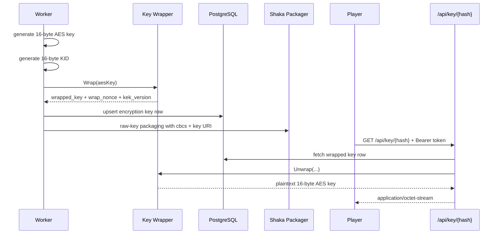

# Encrypted Streaming

Protected playback in Vylux currently uses:

- HLS + CMAF
- raw-key encryption
- `cbcs` protection scheme
- playlist references through `#EXT-X-KEY`

## Where encryption is enabled

Encryption currently appears in:

- `video:transcode` when `options.encrypt=true`
- `video:full` when `options.transcode.encrypt=true`

If `encrypt` is false, the HLS pipeline still runs normally but does not emit encryption metadata or require `/api/key/{hash}`.

## Key-material lifecycle



## What is actually stored in the database

Vylux does not persist plaintext content keys. It stores:

- `wrapped_key`
- `wrap_nonce`
- `kek_version`
- `kid`
- `scheme`
- `key_uri`

In other words, PostgreSQL holds unwrap metadata, not player-ready secret material.

The raw AES content key is also not written to a temporary key file. The worker passes key material directly to Shaka Packager through raw-key CLI arguments, so the deployment no longer needs a separate tmpfs mount just to protect encryption keys on disk.

## The role of `BASE_URL`

When the worker enables encryption, it constructs:

```text
{BASE_URL}/api/key/{hash}
```

as the `key_uri` written into the playlist.

Therefore:

- `BASE_URL` must point to the public Vylux hostname that players can reach
- `BASE_URL` must not have a trailing slash
- if `BASE_URL` is wrong, the playlist may still be generated but playback key fetches will fail

## Key endpoint semantics

The player requests `/api/key/{hash}` when playback reaches encrypted content.

- missing Bearer token: `401 Unauthorized`
- invalid or expired token: `403 Forbidden`
- missing key row for the hash: `404 Not Found`
- valid token: `200 OK` with the 16-byte content key

Additionally:

- successful responses include `Cache-Control: no-store`
- the response type is `application/octet-stream`
- this endpoint does not accept `X-API-Key`; it only accepts Bearer tokens

There is also a Redis-backed rate limit on the key endpoint.

## Bearer token model

The token payload must at least include:

- `hash`
- `exp`

The key handler validates:

1. token format
2. the HMAC-SHA256 signature
3. expiration
4. hash equality between the token payload and the request path

## Integration model

Vylux does not mint playback tokens on its own. Your upstream application is expected to decide who can watch protected media and provide the Bearer token required by the key endpoint.

## Testing expectations

Before validating successful key delivery, obtain a valid Bearer token for the same media hash through your upstream application or a test helper.

At minimum, encrypted-streaming validation should confirm:

- `results.streaming.encrypted == true`
- the playlist contains `#EXT-X-KEY`
- `/api/key/{hash}` returns `401` without a token
- `/api/key/{hash}` returns `403` for an invalid, expired, or mismatched token
- `/api/key/{hash}` returns `404` if no key row exists for the hash
- a valid token returns exactly 16 bytes

## Player integration

If you use hls.js, only attach the `Authorization` header to `/api/key/` requests. Do not put the token in the query string.

```ts showLineNumbers
xhrSetup: (xhr, url) => {
	if (url.includes('/api/key/') && keyToken) {
		xhr.setRequestHeader('Authorization', `Bearer ${keyToken}`);
	}
}
```

## Why raw-key plus a key API

This design is not full DRM. Its purpose is to separate key delivery from media distribution:

- playlists and segments can be cached aggressively by a CDN
- keys stay behind an authenticated API boundary
- the upstream application remains in charge of token issuance and lifetime

That is a practical model for protected media without requiring a full DRM platform.
