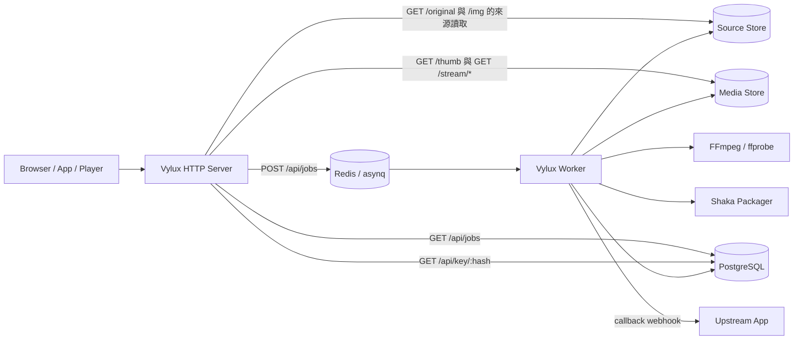

# 架構總覽

Vylux 的核心不是一組鬆散腳本，而是一個單一 binary 配上共享基礎設施：HTTP server、queue worker、PostgreSQL、Redis、S3-compatible storage，以及 FFmpeg / libvips / Shaka Packager 工具鏈。

:::tip 把這頁當成責任邊界地圖來讀
如果你正在判斷某個責任該放在哪一層，先看這頁。Vylux 負責媒體處理與媒體投遞語義；上游應用仍負責業務授權與終端使用者政策。
:::

## Runtime 角色

### `all`

- 同時啟動 HTTP server 與 worker
- 適合本機開發與最小部署

### `server`

- 只處理 HTTP request、同步圖片投遞、播放代理與主要 metrics
- 當你需要擴展或故障隔離時，通常會搭配獨立 worker

### `worker`

- 只消費 queue 任務
- 在 `WORKER_METRICS_PORT` 提供 `/metrics` 與 `/healthz`

這讓 Vylux 在程式模型上維持單一實作，在部署模型上則能自由切成單進程或 server/worker 分離。

## 系統結構

## 元件與責任邊界

| 元件 | 主要責任 |
| --- | --- |
| HTTP server | 提供 `/img`、`/original`、`/thumb`、`/api/jobs`、`/stream`、`/api/key`、`/healthz`、`/readyz`、`/metrics` |
| Worker | 消費非同步任務，下載來源媒體，執行 cover / preview / transcode，回寫結果與 webhook |
| PostgreSQL | 保存 job rows、workflow results、retry metadata、wrapped content keys、image cache tracking |
| Redis | 承載 asynq queue、task state、API rate limit 與 key endpoint rate limit |
| Source store | `SOURCE_BUCKET` 加上 `SOURCE_S3_*`；原始來源物件，Vylux 只讀 |
| Media store | `MEDIA_BUCKET` 加上 `MEDIA_S3_*`；圖片快取、thumbnail、cover、preview、HLS playlist、segment 等輸出，Vylux 讀寫 |
| Media toolchain | `vips` 用於圖片、FFmpeg / ffprobe 用於影片編碼與 probe、Shaka Packager 用於 HLS CMAF 打包 |

## HTTP 伺服器責任

- `/img` 即時圖片處理
- `/original` 帶簽名的原檔代理
- `/thumb` 已處理資產的簽名讀取
- `/api/jobs` 建立與查詢工作
- `/stream/{hash}/*` 代理 HLS 資產
- `/api/key/{hash}` 驗證 Bearer token 後回傳 16-byte AES key
- `/healthz`、`/readyz`、`/metrics`

除了路由之外，HTTP server 也負責：

- request tracing middleware 與 `X-Trace-ID`
- Prometheus HTTP metrics
- `/readyz` 依賴檢查
- API key auth、Redis-based rate limit

## Worker 責任

- 下載來源影片
- 產生 cover / preview / transcode 輸出
- 在需要時產出加密 HLS CMAF
- 上傳媒體結果
- 更新 job 狀態與結果 JSON
- 失敗時寫入 machine-readable workflow state 與 retry plan
- 成功或失敗後回送 webhook callback

Worker 不是只跑單一 `video:transcode`。目前合法任務類型包括：

- `image:thumbnail`
- `video:cover`
- `video:preview`
- `video:transcode`
- `video:full`

其中 `video:full` 是單一 workflow handler，在同一個任務內下載原檔一次，並協調 cover、preview、transcode。

## Queue 模型

Vylux 使用 asynq，定義了三個 queue：

| Queue | 權重 | 目的 |
| --- | --- | --- |
| `critical` | `6` | 快速任務，例如 `image:thumbnail` |
| `default` | `3` | 一般影片任務 |
| `video:large` | `1` | 大檔轉碼的低優先度 queue |

對影片類任務而言，`POST /api/jobs` 會先對 source storage 做前置檢查，取得實際檔案大小，再決定是否要把工作送進 `video:large`。

:::note Queue 選擇不是由呼叫端決定的
呼叫端不會直接指定 `critical`、`default` 或 `video:large`。server 會先驗證請求、必要時檢查真實來源檔案，再決定任務應該進哪個 queue。
:::

## 共用狀態

- PostgreSQL 保存 job、結果與 wrapped content keys
- Redis 提供 asynq queue 與 rate limiting
- source store 與 media store 分別保存原始資產與衍生資產

## 服務不負責的事情

Vylux 刻意不承擔以下責任：

- 不管理終端使用者身份與業務權限
- 不簽發播放 token 或圖片 URL 的授權策略
- 不直接替主應用管理內容生命週期

上游應用應自行決定誰能提交工作、誰能取得簽名 URL、誰能拿到播放 key token。

## 閱讀順序

- 若你想看 request 細節，下一頁讀 [請求生命週期](./request-lifecycle)
- 若你想看 key naming 與 object mapping，讀 [儲存結構](./storage-layout)
- 若你想看實際媒體處理流程，讀 [圖片處理流程](../media/image-pipeline) 與 [影片處理流程](../media/video-pipeline)
