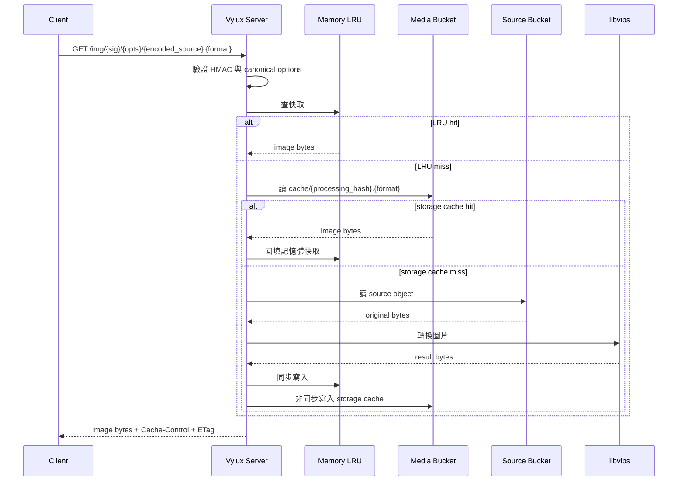
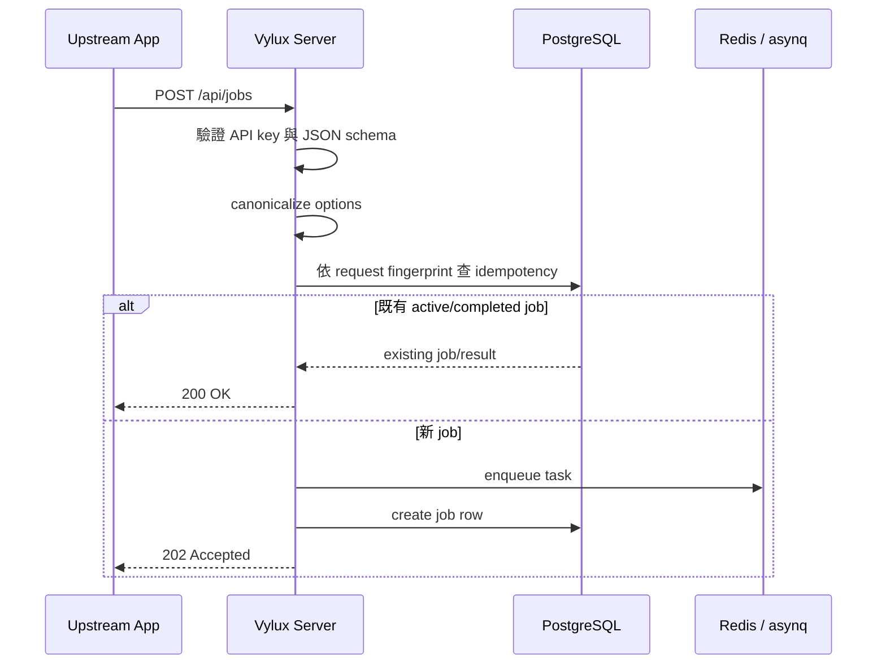
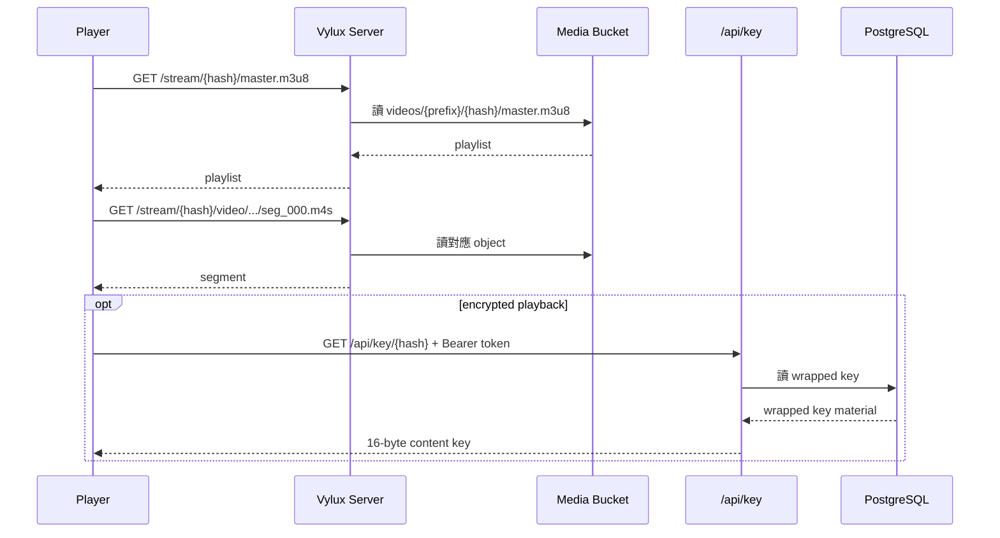

# 請求生命週期

:::tip 先選符合你正在排查的那條流程
如果問題出現在 queue work 建立之前，先看圖片路徑或 job 提交；如果 job 已經被接受，就應直接跳去看 worker 執行、播放或 cleanup。
:::

## 流程地圖

### Synchronous HTTP

- `/img` 的即時圖片投遞
- request 驗證、快取查詢、來源讀取與同步回應

### Asynchronous jobs

- `POST /api/jobs` 的驗證與 idempotency
- Redis / asynq enqueue 與 worker 執行

### Playback and cleanup

- `/stream/{hash}/*` 從 media bucket 做播放讀取
- `/api/key/{hash}` 為加密播放提供 key delivery
- cleanup 會移除衍生資產、queue work 與相關 metadata

## 1. 即時圖片請求

`GET /img/:sig/:opts/*`

實際流程重點：

1. 驗證 HMAC 簽名與 options
2. 先查記憶體 LRU，再查 media bucket 的 storage cache
3. 若 miss，從 source bucket 讀原圖
4. 以 singleflight 避免同一來源或同一處理參數被重複抓取/重複處理
5. 交由 libvips 處理
6. 同步回寫記憶體 LRU，非同步寫入 media bucket cache
7. 回應 `Cache-Control: public, max-age=31536000, immutable` 與 `ETag`

這條路徑完全同步，不依賴 queue。

:::note `/img` 不會等待 worker
如果請求走的是即時圖片路徑，queue 根本不會參與。這時應先排查 request 驗證、快取命中、source 讀取與 libvips 執行。
:::

## 2. Job 提交

`POST /api/jobs`

實作上的關鍵不是只有 enqueue，而是先做 request fingerprint：

1. server 驗證 API key 與 payload
2. 針對 `type + hash + source + canonicalized options` 做 idempotency 檢查
3. 若有既有活躍 job 或已完成結果，直接返回
4. 否則 enqueue 到 Redis / asynq
5. 建立 PostgreSQL job row，初始狀態為 `queued`

來源 bucket 本身不是呼叫端可覆寫的欄位，而是由部署時的 runtime 設定決定。

對影片類工作，server 在 enqueue 前還會檢查 source store，確認物件存在、量測實際大小，並在需要時把大型任務路由到 `video:large`。

:::tip `202 Accepted` 代表問題邊界已經進入 worker
當 server 已回 `202 Accepted`，代表 request 驗證大致通過；後續若有問題，下一個排查邊界通常是 worker 執行，而不是 HTTP 請求本身。
:::

## 3. Worker 執行

Worker 執行可分成兩類：單階段任務，以及 `video:full` workflow。

### 單階段任務

- `image:thumbnail`
- `video:cover`
- `video:preview`
- `video:transcode`

共同模式：

1. worker 從 queue 取出 task
2. 把 task status 更新為 `processing`
3. 從 source bucket 下載或讀取來源檔
4. 執行媒體工具鏈
5. 上傳 artifacts 到 media bucket
6. 更新 job results 與 progress
7. 視需要送 webhook callback

### `video:full` workflow

`video:full` 不是把 cover / preview / transcode 分裂成三個父子 job，而是在單一 worker task 內完成：

1. 下載來源檔一次
2. 並行執行 cover 與 preview
3. 若任一失敗，產生 machine-readable `stages` 與 `retry_plan`
4. 若兩者成功，再進入 transcode
5. 聚合所有 artifacts 後回寫單一結果 JSON

這讓外部看到的是一個 job，但結果仍保有每個 stage 的可觀測性。

:::info `video:full` 是單一 workflow，不是父子 job 圖
在看 logs、trace 或 retry 行為時，請把 `video:full` 理解成單一 worker 擁有的 workflow，裡面帶有 stage-level 結果，而不是多個獨立的公開 job。
:::

## 4. HLS 播放

`GET /stream/{hash}/*`

播放時，server 不在本地存 segment，而是依 `{hash}` 與後綴路徑映射到 media bucket：

- `master.m3u8`
- `audio/{track_id}/...`
- `video/{variant}/...`

對於未加密內容，播放器只需走 `/stream/...`。

對於加密內容，播放器還會額外呼叫 `/api/key/{hash}`，並帶 `Authorization: Bearer {token}`。

:::note 播放對外應走穩定 public routes，而不是 storage key
對外播放器應使用 `/stream/{hash}` 與 `/api/key/{hash}`。raw media-bucket key 仍應視為內部儲存細節。
:::

## 5. 清理

`DELETE /api/media/{hash}` 的生命週期比較短，但對資料一致性很重要：

1. 依 `hash` 找出相關 media bucket objects
2. 清除 image cache tracking 與相關資料列
3. 取消 queue 中的 active / retry / scheduled tasks
4. 刪除 encryption key 與 job 紀錄

這個流程設計為 best-effort 與 idempotent，適合上游補償流程重複呼叫。

:::tip cleanup 設計上就應該可安全重試
因為 cleanup 是 best-effort 且 idempotent，上游的 retention 或補償流程可以安全重複呼叫，不必把每次重試都視為錯誤。
:::
