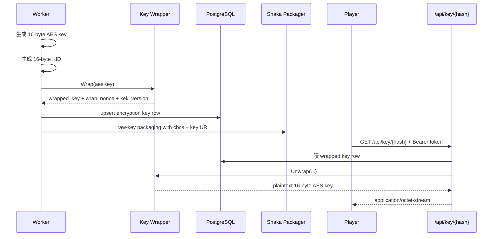

# 加密串流

Vylux 目前的受限影片模式是：

- HLS + CMAF
- raw-key encryption
- protection scheme: `cbcs`
- playlist 以 `#EXT-X-KEY` 指向 `/api/key/{hash}`

## 只在哪些任務啟用

加密目前出現在：

- `video:transcode` 且 `options.encrypt=true`
- `video:full` 且 `options.transcode.encrypt=true`

若未開啟 `encrypt`，整條 HLS pipeline 仍正常產出，只是不會產生 encryption metadata，也不會有 `/api/key/{hash}` 的存取需求。

## key material 生命週期



## 資料庫裡實際保存什麼

Vylux 不把 plaintext content key 存進資料庫，而是保存：

- `wrapped_key`
- `wrap_nonce`
- `kek_version`
- `kid`
- `scheme`
- `key_uri`

也就是說，資料庫裡存的是可解包 metadata，而不是可以直接被播放器使用的明文 key。

此外，raw AES content key 也不會先寫成暫存 key 檔。worker 會直接把 key material 透過 Shaka Packager 的 raw-key CLI 參數傳入，因此部署上不再需要為了保護磁碟 key 檔而另外準備 tmpfs mount。

## `BASE_URL` 的角色

當 worker 啟用加密時，會用：

```text
{BASE_URL}/api/key/{hash}
```

組成 `key_uri`，並交給 packager 寫進 playlist。

因此：

- `BASE_URL` 應指向播放器實際可訪問的 Vylux 對外域名
- `BASE_URL` 不可有 trailing slash
- 若 `BASE_URL` 設錯，playlist 仍可能生成，但播放器抓 key 時會失敗

## 金鑰端點語義

`GET /api/key/{hash}`

Header:

```text
Authorization: Bearer {token}
```

狀態碼語義：

- `200`: token 有效，回傳 16-byte AES key
- `401`: 缺少 token
- `403`: token 無效、過期或 hash 不匹配
- `404`: 找不到對應加密 key

此外：

- 成功回應會帶 `Cache-Control: no-store`
- 回傳 `application/octet-stream`
- 該端點不接受 `X-API-Key`，只接受 Bearer token

這個端點也有 Redis-based rate limit，避免 key endpoint 被高頻濫用。

## Bearer token 模型

token payload 至少包含：

- `hash`
- `exp`

handler 會檢查：

1. token 格式是否正確
2. HMAC-SHA256 簽名是否正確
3. `exp` 是否未過期
4. payload 內的 `hash` 是否與 path 一致

## 整合模型

Vylux 不會自行簽發播放 token。你的上游應用應決定誰可以觀看受保護內容，並提供 `/api/key/{hash}` 所需的 Bearer token。

## 測試方式

先由你的上游應用或測試工具產生一個對應該 media hash 的合法 Bearer token：

```bash
KEY_TOKEN='<valid bearer token for this media hash>'
```

搭配測試命令可以驗證：

- `results.streaming.encrypted == true`
- encrypted job 結果為 `true`
- media playlist 出現 `#EXT-X-KEY`
- 未帶 token 取得 `401`
- 帶錯誤、過期或 hash 不匹配 token 時取得 `403`
- hash 沒有對應 key row 時取得 `404`
- 帶合法 token 時回傳 `16` bytes key

## 播放器整合

若使用 hls.js，關鍵點是只對 `/api/key/` 請求附加 `Authorization` header，不要把 token 放進 query string。

```ts showLineNumbers
xhrSetup: (xhr, url) => {
  if (url.includes('/api/key/') && keyToken) {
    xhr.setRequestHeader('Authorization', `Bearer ${keyToken}`);
  }
}
```

## 為什麼採 raw-key + key API

這個模型的目的不是 DRM，而是把金鑰交付與媒體分發拆開：

- playlist 與 segments 可以交給 CDN 長時間快取
- key 仍經過受控 API 邊界
- 上游應用可以自行決定 token 的簽發與有效期

這對「受保護但不需要完整 DRM 平台」的場景很實用。
